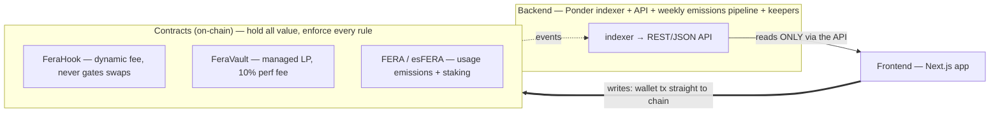

# FERA

**The liquidity layer that prices what others bleed.**

FERA is a Uniswap v4 liquidity layer on Robinhood Chain. A dynamic-fee **hook** charges volatile,
mechanical, and weekend-arbitrage trading flow the fee it is actually worth — so the volatility that
drains ordinary liquidity providers pays FERA's providers instead — and a managed **vault** lets
anyone provide liquidity to a memecoin or tokenized-stock pool without running a keeper.

- Swaps are **never gated and never charged a protocol fee.**
- FERA charges **one** fee: a **10% performance fee** on the swap fees your liquidity collects — and
  nothing on your principal, deposits, or withdrawals.
- A usage-only emission token whose issuance **can never exceed protocol revenue.**

## System at a glance



*Three layers; the frontend reads only through the API and writes only by sending wallet
transactions to chain.* **Honesty note:** the contracts are feature-complete but **not deployed
yet** — today the "live" API is a standalone GeckoTerminal-backed dev server (every vault field
`vaultLive:false`) and write paths are mocked.

## Documentation

**Read the docs: [`docs/gitbook/`](docs/gitbook/README.md)** — the canonical, GitBook-synced
documentation set, and the only documentation kept in this public repo. Start with the
[Introduction](docs/gitbook/README.md) and [What is FERA?](docs/gitbook/what-is-fera.md).
Deeper internal specs, audit reports, and deployment runbooks are kept privately by the team.

| If you are… | Read |
|-------------|------|
| A liquidity provider | [LP guide](docs/gitbook/lp-guide.md), [How the fee works](docs/gitbook/how-fees-work.md), [Rewards & vesting](docs/gitbook/rewards-and-vesting.md), [Risks](docs/gitbook/risks.md) |
| Curious about the token | [Emissions & tokenomics](docs/gitbook/emissions-and-tokenomics.md), [Transparency](docs/gitbook/transparency.md) |
| Evaluating safety | [Security](docs/gitbook/security.md) |
| A developer / integrator | [Developers](docs/gitbook/developers.md) |

## Repository layout

| Path | Contents |
|------|----------|
| [`docs/gitbook/`](docs/gitbook/README.md) | The public documentation set (GitBook-synced via `SUMMARY.md`). |
| `docs/mechanism/`, `docs/research/` | Runnable fee-math sims and backtest data supporting the docs. |
| `contracts/` | Foundry project — the v4 hook, vault, token, emissions, staking, treasury. |
| `backend/` | Ponder indexer, REST/JSON API, the deterministic weekly emissions pipeline, and keepers. |
| `frontend/` | Next.js app. |
| `pressure-test/harnesses/` | Runnable validation / attack simulation scripts. |

## Design invariants

1. **Swaps are never gated and never charged a protocol fee** — any router / aggregator / bot may
   swap permissionlessly. Liquidity provision is open too; only vault deposits earn emissions.
2. **Traders (incl. bots) pay zero protocol fees.** LPs pay a 10% performance fee only on yield they
   earn, at fee-collection time — never on principal, swaps, or deposits.
3. **Withdrawals and swaps can never be paused.** Pause is allowed on vault *deposits* only.
4. **Emissions ≤ min( logistic cap(t), β × epoch revenue )** every epoch — an earned claim on real
   activity, not a subsidy.
5. **No upgradeable proxies on money paths.** Parameters are immutable or behind a 48-hour timelock.

## Build

```bash
# Contracts (Foundry, Solidity 0.8.26)
cd contracts && git submodule update --init --recursive && forge build && forge test

# Backend (Node ≥ 20, Ponder)
cd backend && npm run typecheck && npm run pipeline:dryrun
```

See [`docs/gitbook/developers.md`](docs/gitbook/developers.md) for the full workflow.

## A note on honesty

FERA is infrastructure, not a wealth machine. We never claim guaranteed yield, and we do **not**
claim the vault out-earns a skilled self-managed liquidity position. Every number the app shows is
reproducible from public on-chain data — see [Transparency](docs/gitbook/transparency.md). If any
doc reads like hype, treat it as a bug.

---

*Internal engineering-process notes (decision logs, working memos, GTM playbooks) are kept locally
under `internal/` and are intentionally git-ignored — see `internal/CLEANUP_MANIFEST.md`.*
